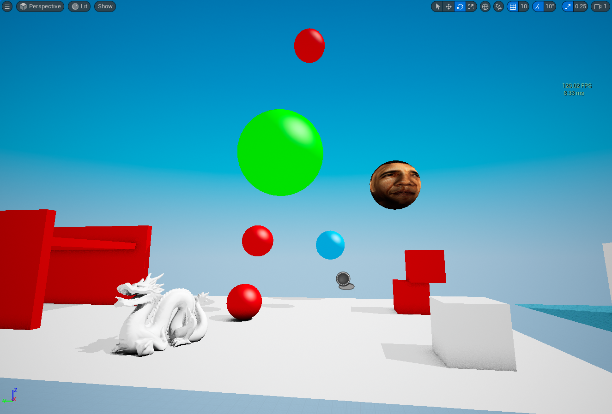

## __AquaRay Raytracer for Unreal Engine 5.2.1__
A Custom Hacked-In DXR Realtime Raytracer for Unreal Engine 5.2.1 Built for my Upcoming Game Project "BryceIB"

I was always fascinated by Raytracing for a long time, wanting to make a Game where the Environment is built on 2000s Digital Art Styles, Fully Raytraced. After finding out that Lumen and NVRTX ~~suck~~ are not satisfactory for my project, I decided to make my own Raytracer that would suit the what i need.

After YEARS of brute forcing a solution, I came up with this.... hack. It uses Unreal Engine's Raytracing Debug System to sneak in Custom Raytracing Passes, activating them using Console Commands.

It should work in Unreal 5.2.1, but im not sure about other versions. But you can try
Make sure you have a HWRT DirectX 16 SM6 Capable GPU, the sample project runs around 120fps on Geforce RTX 3050 

# __How to Install__
1: Install Unreal Engine 5.2.1 Source  if you havent already
-Should be 108GB in size, make sure to install on a fast drive, or you will be waiting DAYS for it to compile
-https://www.unrealengine.com/en-US/ue-on-github
-https://dev.epicgames.com/documentation/en-us/unreal-engine/building-unreal-engine-from-source

2: Compile a Vannila Build of 5.2.1 and test if its all working

3: Replace/add files from this repository to your Engine Source
-NOTE: For RayTracingDebug.cpp you must find the if statement for enabling the PrimaryRays viewmode in your source, and Replace it with the version on this Repository
-Other files should be only Replace/Add

4: Recompile the Engine Again

5: Download the AquaRay sample Project from this Repository and add it to your Unreal Projects folder

6: If all stars Align, you should successfully load into the project without any Explosions or Crashes
-Load into "emptytestmap" and Click the AquaRayController Actor
-In the Details Panel, Click "Apply Settings", and "Enable Aquaray"
-After Clicking the button of Doom, you will be either Greeted by a "D3D Crashed" window, or a Fantastic Fully Raytraced Scene in your Viewport

# __Footnotes__

The Sample project uses:
-Skyboxes from [PolyHaven](https://polyhaven.com/)
-Some Models by the [Stanford University](https://graphics.stanford.edu/data/3Dscanrep/)
